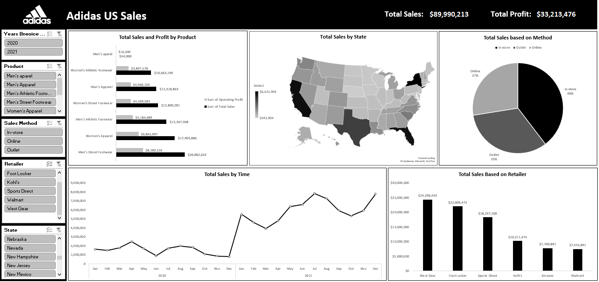
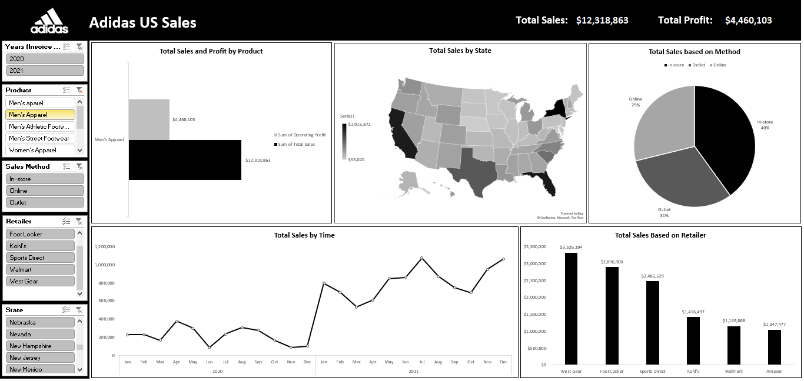
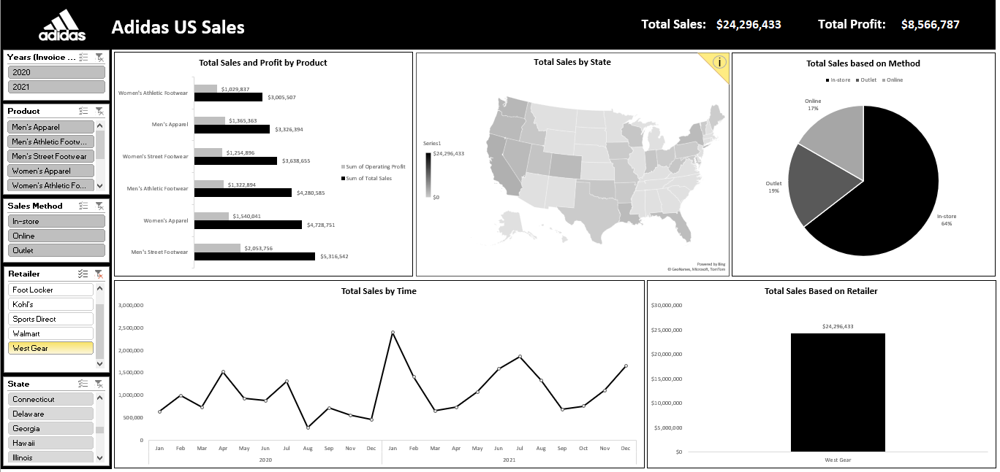
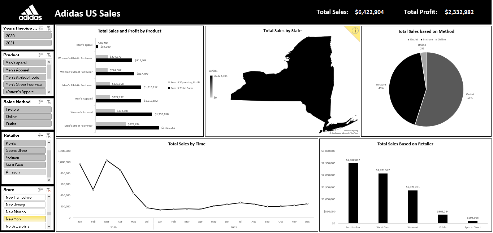
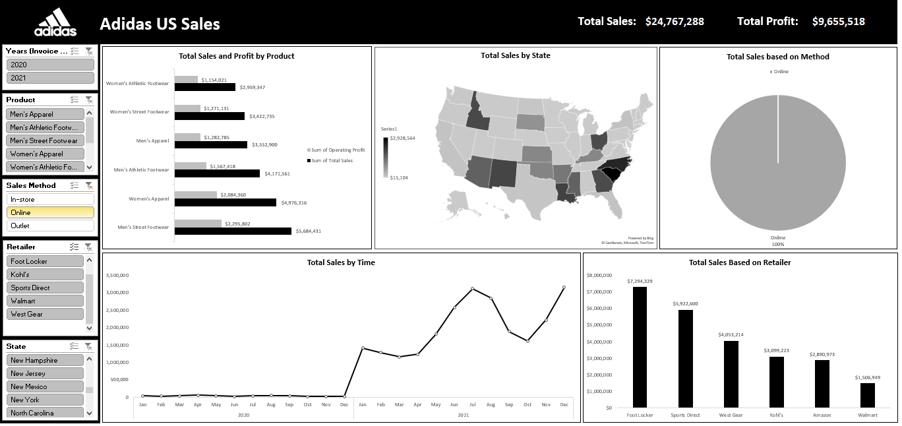

# 👟 Adidas US Sales Analysis — Excel Dashboard

> An interactive Excel dashboard analyzing Adidas sales performance across the United States for 2020 and 2021 — covering products, retailers, states, and sales channels.

---

## 📌 Project Overview

This project analyzes **Adidas US sales data** for the years **2020–2021** using Microsoft Excel. The goal was to transform raw transactional data into a fully interactive dashboard that delivers clear business insights across multiple dimensions.

| Detail | Info |
|---|---|
| **Tool** | Microsoft Excel |
| **Dataset** | Adidas US Sales (2020–2021) |
| **Focus** | Products · Retailers · States · Sales Channels |

---

## 📊 Dashboard Screenshots

### Overview — All Data

All KPIs at a glance: **Total Sales $89.99M** and **Total Profit $33.21M** across all products, retailers, and states.

---

### Filtered by Product — Men's Apparel

Drill-down into **Men's Apparel**: **$12.3M in sales** and **$4.46M profit**. West Gear leads retailer performance at $3.33M.

---

### Filtered by Retailer — West Gear

**West Gear** is the top-performing retailer with **$24.3M in total sales** and **$8.57M profit**. In-store channel dominates at 64%.

---

### Filtered by State — New York

**New York** generated **$6.42M in sales** with Outlet as the dominant channel at 55%. Foot Locker leads at $2.5M.

---

### Filtered by Sales Method — Online

The **Online channel** contributed **$24.77M in sales** and **$9.66M profit**. Foot Locker leads online at $7.29M.

---

## 💡 Key Insights

- 💰 **Total Sales: $89.99M** | **Total Profit: $33.21M** (37% profit margin)
- 👟 **Men's Street Footwear** is the best-selling product at **$20.88M**
- 🏆 **West Gear** is the #1 retailer at **$24.3M**, followed by Foot Locker at **$22M**
- 🏪 **In-store** is the dominant sales channel at **40%** of total sales
- 📈 Sales show a clear **upward trend in H2 2021**, peaking in July–August
- 🗺️ **New York** is the highest-revenue state, driven by Outlet channel and Foot Locker

---

## 🛠️ Tools & Techniques

- **Microsoft Excel** — PivotTables, PivotCharts, Slicers
- **Data Cleaning** — Handled missing values, standardized formats
- **Interactive Filters** — Year, Product, Sales Method, Retailer, State
- **Visualizations** — Bar charts, Line chart, Pie chart, US Map

---

## 📁 Files in This Repo

| File | Description |
|---|---|
| `Adidas_US_Sales_Datasets.xlsx` | Raw dataset + interactive dashboard |
| `1.png` → `5.png` | Dashboard screenshots for all filter views |

---

## 🚀 How to Use

1. Download `Adidas_US_Sales_Datasets.xlsx`
2. Open in **Microsoft Excel** (2016 or later recommended)
3. Use the slicers on the left to filter by **Year / Product / Sales Method / Retailer / State**
4. All charts and KPIs update dynamically

---

## 👤 Author

**Belal Farrag** — Data Analyst

